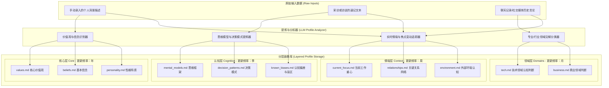
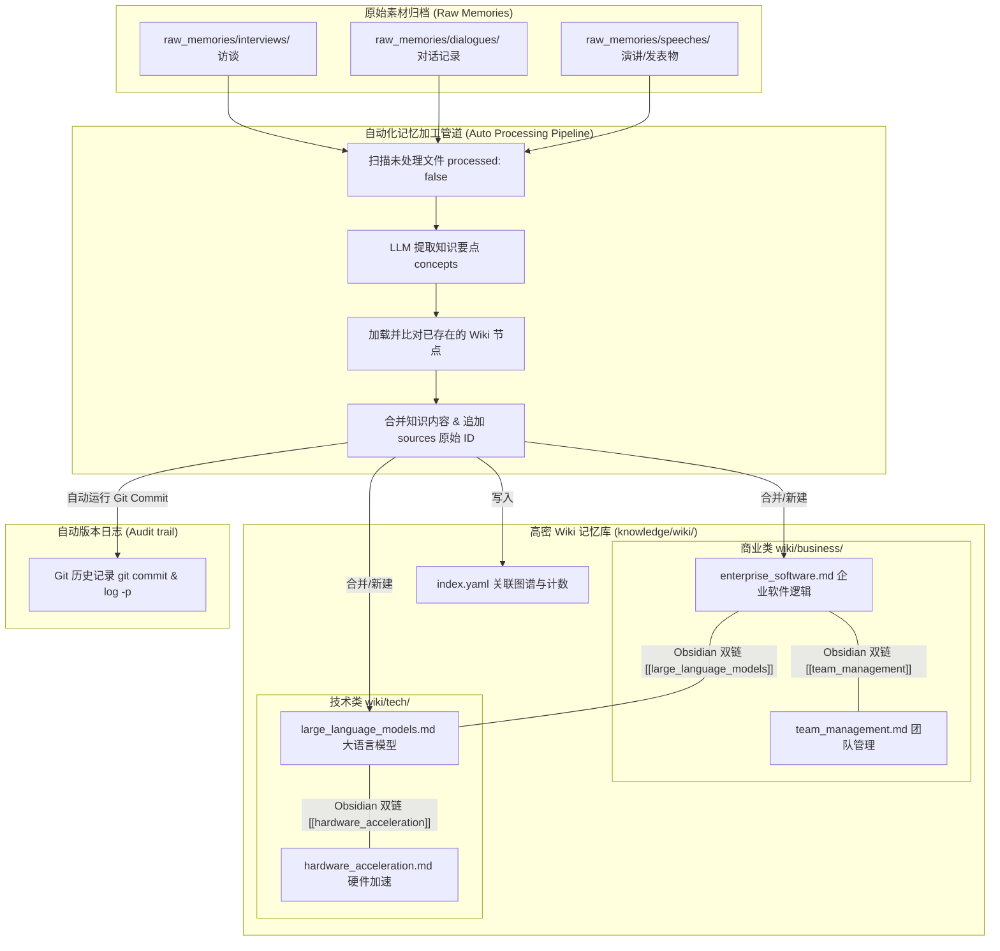
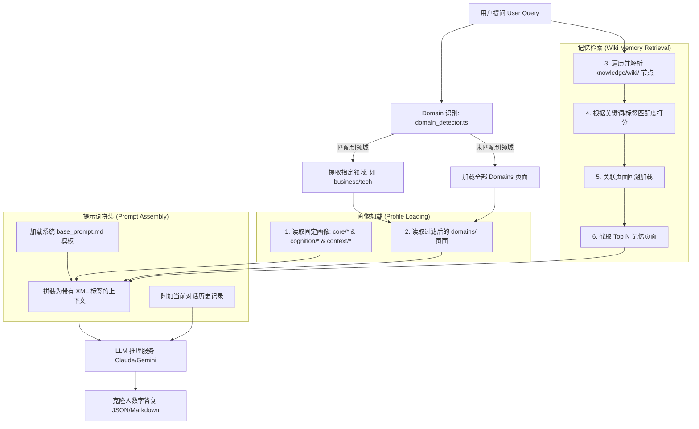

# [TODO] llme 个人数字克隆系统——画像、记忆与对话架构说明

更新日期：2026-06-30

本说明文档通过信息流与架构图，直观展现升级后 llme 系统在画像分层构造、记忆自动化加工以及对话装配三个场景下的完整运作机制。

---

## 1. 场景一：画像的分层构造与动态更新（数字人生命周期）

此场景展示如何从用户手动描述、原始对话、访谈等文本中，利用大语言模型（LLM）将散乱信息沉淀并分类整理为数字克隆人的**四层静态画像**。

### 关键步骤说明
1.  **输入接收**：归档原始非结构化文本（包括直接描述、访谈速记及日常聊天对话记录）。
2.  **分流提炼**：大模型识别文本中所体现的人格特征、分析视角或当下动态。
3.  **分层沉淀**：
    *   **核心层**：写入人格基本盘，稳定性极高（如“本分”、“诚信”）。
    *   **认知层**：提炼反复使用的逻辑框架（如“第一性原理”）。
    *   **领域层**：分门别类地记录特定行业的认知（如对大模型的态度）。
    *   **情境层**：维护短期活跃变量（如当前焦点、关系变化、外部约束）。**该层除了系统初始化手工输入外，会由“场景二：日常记忆加工流水线”根据日常对话内容进行全自动覆写与更新，不设人工 Review 阻断，依靠 Git 进行事后审计追踪。**

---

## 2. 场景二：记忆的自动化提炼与关联加工（LLM-Wiki 流水线）

此场景展示如何将口语化的、低密度的日常原始记忆自动化转化为高密度的主题 Wiki 网，并自动产生溯源图谱与 Git 提交版本日志。

### 关键步骤说明
1.  **文件检索**：通过字段扫描筛选未加工的原始文件（processed: false）。
2.  **观点与画像分流提炼**：大模型读取原始数据进行**双向提取**：
    *   **记忆提取**：提炼高密度观点/事实，进入 Wiki 知识库更新流程。
    *   **情境提取**：检测对话中是否包含“焦点变化、关系状态转移、外部环境变动”等高频情境信息，提炼为情境层增量，写入 `profile/context/`。
3.  **Wiki合并与双链**：若提炼的概念已存在，LLM 合并正文并追加 sources 原文件 ID，自动生成 `[[Concept]]` 双链并更新 `index.yaml`。
4.  **自动写入与 Git 审计**：直接覆写对应的 Wiki 页面与 `profile/context/` 下的情境文件，随后触发 Git Commit 提交所有变更。

---

## 3. 场景三：画像与记忆在对话中的装配应用（RAG 运行期）

此场景展示在用户输入问题时，后端引擎如何读取分层画像、计算匹配高密 Wiki 节点，并在大语言模型上下文预算内最终组装成数字人答复的完整过程。

### 关键步骤说明
1.  **关键词识别**：[domain-detector.ts](file:///Users/zhoufan/Public/workspace/llme/app/server/src/lib/domain-detector.ts) 精确识别查询的关注点。
2.  **并行组装**：
    *   **核心画像**（恒定加载）：确保数字人行为和底色保持一致。
    *   **Wiki 记忆**：[knowledge-retriever.ts](file:///Users/zhoufan/Public/workspace/llme/app/server/src/lib/knowledge-retriever.ts) 根据打分结果和双链指向，智能捞取最相关的概念面。
3.  **XML 包装**：使用标准的 `<core>`、`<cognition>`、`<domain>` 以及 `<knowledge>` 标签对各模块进行围闭隔离，方便 LLM 准确解构上下文。
4.  **模型流式输出**：LLM 扮演数字克隆人本人身份，根据上下文直接给出符合其认知的解答。
