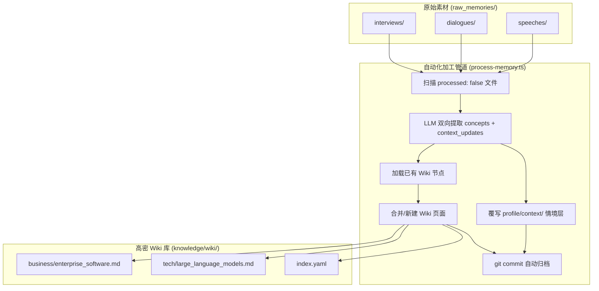
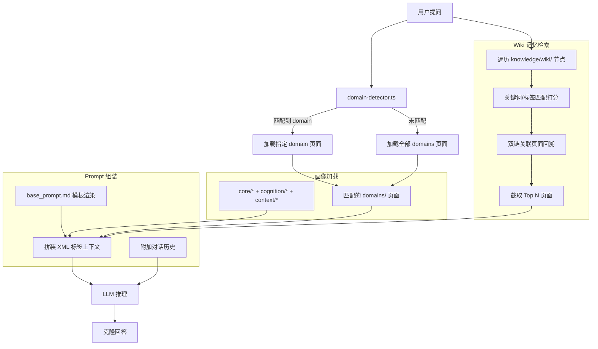
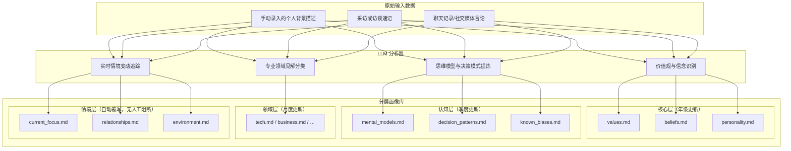

# llme — 系统设计文档

更新日期：2026-06-30

本文档是 llme 个人数字克隆系统的统一设计参考，整合了产品定位、当前技术实现，以及后续升级的 TODO 规划。

---

## 一、产品定位

llme 是一个轻量级的个人数字克隆系统，通过结构化的个人画像提示词 + 个人知识记忆库，结合大语言模型，复现特定个人的认知方式、思维框架和决策逻辑。

**核心设计原则：**
- 不做 SFT / 不做算法调优，完全依托 prompt engineering + RAG 实现
- 聚焦认知和决策逻辑的复刻，不追求语气/措辞的模仿
- 所有数据（画像、知识库）以 Markdown + YAML 格式存储，便于人工 review 和 git 版本控制
- 画像和知识库分离，支持独立维护和更新
- 本地记忆优先，只有在问题明显时间敏感或本地信息不足时才开放外部搜索

**非目标（Out of Scope）：**
- 语气、说话风格、口头禅的模仿
- 默认每轮都联网的通用搜索助手模式
- 多用户 / 多租户云端部署
- 移动端

---

## 二、核心概念

### 个人画像（Profile）
描述一个人"是谁、怎么想"的结构化文档集合，分四层：

| 层次 | 内容 | 更新频率 |
|------|------|----------|
| 核心层（core） | 价值观、基本信念、性格特质 | 低（年级） |
| 认知层（cognition） | 思维框架、决策模式、已知偏差 | 中（季度） |
| 领域层（domains） | 各领域的判断和方法论 | 中（月度） |
| 情境层（context） | 当前关注、关系网络、外部环境 | 高（周度） |

### 知识记忆库（Knowledge Base）
记录个人观点、判断、决策过程的结构化条目集合。每条条目都有 YAML 元数据，支持按 domain、tag、时间过滤检索。

### 外部信息获取（Web Search）
外部搜索不是独立替代本地知识的主来源，而是一个按需开启的补充层，用来处理最新、最近、今天、当前等时间敏感问题，或补足本地记忆明显不足的事实信息。

### 克隆对话（Clone Chat）
用户向克隆提问，系统自动组装个人画像 + 相关知识条目作为上下文，调用 LLM 生成符合该人认知特征的回答。

### 对话编排器（Chat Orchestrator）
对话编排器负责决定本轮只使用本地画像和本地记忆，还是额外开放联网搜索工具。其职责不是替代画像和记忆，而是协调不同信息层的使用顺序和边界。

---

## 三、当前技术栈

| 层次 | 选型 | 说明 |
|------|------|------|
| 后端（本地开发） | TypeScript + Node.js + Hono | 轻量 HTTP 框架 |
| 后端（生产） | Vercel Serverless Functions | `api/` 目录下的 TypeScript 函数 |
| 前端 | React + Vite + Tailwind CSS | Web UI |
| LLM | OpenAI 兼容 SDK | 通过 `.env` 配置 endpoint + model，支持 OpenRouter 等代理 |
| 存储 | 本地文件系统（Markdown + YAML） | 无数据库，git 原生版本控制 |
| 检索 | YAML frontmatter 过滤 + 关键词匹配打分 | 当前无向量检索 |
| 外部信息获取 | OpenRouter `openrouter:web_search` | 仅在后端判定需要时对模型开放 |
| 包管理 | npm（根目录）/ pnpm（app/ 子目录） | — |

---

## 四、目录结构

```
llme/
├── .env                             # 环境变量（API Key、Base URL、Model Name）
├── vercel.json                      # Vercel 部署配置
├── api/                             # Vercel Serverless Functions（生产入口）
│   ├── _helpers.ts / _shared.ts
│   ├── chat.ts                      # POST /api/chat
│   ├── health.ts
│   ├── profiles/[id]/avatar.ts
│   ├── profiles/[id]/documents.ts
│   └── diagnostics/
├── app/
│   ├── server/src/                  # Hono 后端（本地开发）
│   │   ├── config.ts
│   │   ├── lib/
│   │   │   ├── chat-runner.ts
│   │   │   ├── domain-detector.ts
│   │   │   ├── knowledge-retriever.ts
│   │   │   ├── profile-loader.ts
│   │   │   └── prompt-assembler.ts
│   │   └── routes/
│   └── web/src/                     # React 前端
│       ├── api.ts
│       ├── pages/ (Chat, Admin, ProfileSelect, Login)
│       └── components/
└── profiles/
    ├── _shared/system/base_prompt.md  # 共享角色 prompt 模板
    ├── create-profile.sh
    └── {name}/
        ├── meta.yaml
        ├── assets/avatar.jpg
        ├── profile/
        │   ├── core/ (values, beliefs, personality)
        │   ├── cognition/ (mental_models, decision_patterns, known_biases)
        │   ├── domains/ (tech, business, …)
        │   └── context/ (current_focus, relationships, environment)
        ├── knowledge/
        │   ├── entries/             # 知识条目
        │   ├── decisions/           # 决策日志
        │   └── index.yaml
        └── system/assembly.md       # 组装规则说明
```

---

## 五、数据 Schema

### 人物元数据（meta.yaml）

```yaml
name: "人物姓名"
description: "简短描述，用于 base_prompt 占位符替换"
avatar: "assets/avatar.jpg"
```

### 画像文件 YAML Frontmatter

```yaml
---
layer: core | cognition | domains | context
last_updated: YYYY-MM-DD
stability: high | medium | low
---
```

### 知识条目（knowledge/entries/YYYY-MM-DD-{slug}.md）

```yaml
---
id: "YYYY-MM-DD-{n}"
date: YYYY-MM-DD
type: opinion | framework | fact | reflection
domain: [tech, business, product, people, life]
tags: []
confidence: high | medium | low
source: "来源描述"
related_profile: []
---
```

### 决策日志（knowledge/decisions/YYYY-MM-DD-{slug}.md）

```yaml
---
id: "decision-YYYY-MM-DD-{n}"
date: YYYY-MM-DD
type: decision
domain: []
tags: []
outcome: pending | validated | invalidated
---
```

正文结构：`## 场景` / `## 选项对比` / `## 决策及推理` / `## 后续验证`

### 知识库索引（knowledge/index.yaml）

```yaml
profile: name
created: YYYY-MM-DD
last_updated: YYYY-MM-DD
entry_count: 0
decision_count: 0
tag_index: {}
domain_index: {}
```

---

## 六、知识分层与职责

当前系统使用四层职责分离：

- `profile`
  - 负责人格、价值观、思维方式、长期稳定偏好
- `local memory`
  - 负责本地知识条目、历史材料、决策记录、长期有效但可更新的背景事实
- `web search`
  - 负责最新事实、外部变化、时间敏感信息
- `chat orchestrator`
  - 负责判断本轮该调用哪几层，以及如何合并后再生成回答

可理解为：

- `profile` = 这个人怎么想
- `local memory` = 这个人过去知道什么、积累了什么
- `web search` = 外部世界最近发生了什么
- `orchestrator` = 这次回答该参考哪些信息源

---

## 七、对话装配流程（当前实现）

### 7.1 流程总览

```
用户提问
  → chat-runner.ts：判断 webSearchMode、分析本地记忆命中、决定是否开放联网搜索
  → domain-detector.ts：关键词匹配，识别 domain（tech / business / …）
  → profile-loader.ts：读取 core/*、cognition/*、context/*、domains/{matched}.md
  → knowledge-retriever.ts：entries + decisions，domain 过滤 + tag 打分，取前 10 条
  → prompt-assembler.ts：拼装 XML 结构 system prompt
  → OpenAI 兼容 API：按需附带 OpenRouter `openrouter:web_search` tool，返回结构化 JSON
  → 前端 MessageBubble 渲染 JSON 字段
```

### 7.2 Prompt 组装结构

`_shared/system/base_prompt.md` 渲染后作为根，后续追加 XML 标签包裹的画像和知识：

```xml
{base_prompt（含角色定义、行为准则、格式要求）}

<core>
  {values.md + beliefs.md + personality.md}
</core>

<cognition>
  {mental_models.md + decision_patterns.md + known_biases.md}
</cognition>

<context>
  {current_focus.md + relationships.md + environment.md}
</context>

<domain name="tech">
  {domains/tech.md}
</domain>

<knowledge>
  {entry1 内容}
  ---
  {entry2 内容}
</knowledge>
```

### 7.3 Domain 识别

`domain-detector.ts` 使用关键词表进行字符串匹配，目前支持 `tech`（技术/AI/工程等关键词）和 `business`（公司/市场/投资等关键词）两个 domain。

- 匹配到 domain → 仅加载对应 `domains/{domain}.md`
- 未匹配 → 加载全部 domains 文件

### 7.4 知识检索算法（当前版本）

```
inputs: knowledgeDir, domains[], query

1. 加载 entries/ + decisions/ 下全部 .md 文件
2. domain 过滤（entries 的 domain 字段与 domains 参数有交集）
3. 按 tag 与 query token 的交集数量打分
4. score DESC 排序，取前 10 条正文内容
```

除正文检索外，系统还会保留分数信息，用于判断本地记忆是否足以支持本轮回答，作为是否开放联网搜索的 gating 信号。

### 7.5 联网搜索 gating（当前版本）

当前不是“每轮都给模型联网权限”，而是由 `chat-runner.ts` 先做一层本地判断，再决定本轮是否附带 `openrouter:web_search`。

请求模式：

- `off`
  - 强制关闭联网，只使用 `profile + local memory`
- `auto`
  - 默认模式；先检查时间敏感性、显式搜索意图、本地知识命中情况，再决定是否开放联网

`auto` 模式下的判断原则：

1. 用户明确要求“搜一下 / 查一下 / search / look up” → 开放联网
2. 问题包含“最新 / 最近 / 今天 / 当前 / latest / recent / today”等时间敏感信号 → 开放联网
3. 本地记忆已有明显相关命中 → 优先本地，不开放联网
4. 问题偏风格、价值观、思维、判断方式，且没有时间敏感信号 → 不开放联网
5. 问题偏事实查询，且本地记忆没有明显命中 → 开放联网

这个设计的目标是保证：

- 本地记忆优先
- 联网搜索只在需要时使用
- 搜索结果是补充层，不直接替代人物画像和本地记忆

### 7.6 响应格式

LLM 被要求输出合法 JSON（非 Markdown）：

```json
{
  "intro": "开场核心判断（1-3 句）",
  "sections": [
    {
      "title": "小标题",
      "bullets": ["要点1", "要点2"],
      "paragraphs": ["补充说明"]
    }
  ],
  "conclusion": "简短结论",
  "followUp": "追问或空字符串"
}
```

### 7.7 Token 预算参考

| 部分 | 目标上限 |
|------|----------|
| 固定加载（画像核心） | 2000 tokens |
| 条件加载（域 + 知识） | 3000 tokens |
| 对话历史 | ≥ 4000 tokens |
| 总上下文 | ≤ 32K tokens |

---

## 八、当前实现状态

截至 2026-06-30，系统已经完成以下改造：

- 后端聊天主逻辑收敛到 `app/server/src/lib/chat-runner.ts`
- 本地开发入口和 `api/` 生产入口复用同一套聊天执行逻辑
- 聊天请求支持 `webSearchMode`
- 默认模式为 `auto`
- 只有在后端本地判断需要时，才向 OpenRouter 请求附带 `openrouter:web_search`

这意味着当前系统的实际行为已经从“纯本地 prompt + knowledge 问答”升级为：

`profile + local memory + conditional web search -> structured answer`

---

## 七、部署与开发

### 生产（Vercel）

`api/` 目录下的 TypeScript 文件自动部署为 Serverless Functions，`profiles/` 目录通过 `vercel.json` 的 `includeFiles` 打包进函数运行时。前端静态资源由 `npm run build:web` 构建后部署到 CDN。

### 本地开发

```bash
npm --prefix app run dev   # 同时启动 Hono 后端（:3001）+ Vite 前端（:3000）
```

环境变量（根目录 `.env`）：
```
OPENAI_API_KEY=your-api-key
OPENAI_BASE_URL=https://openrouter.ai/api/v1
OPENAI_MODEL_NAME=google/gemini-flash-2.0
```

### 新增人物画像

```bash
./profiles/create-profile.sh {name}   # 创建目录脚手架
# 然后编辑 meta.yaml 和 profile/ 下各层文件
```

---

## 八、评估标准

维护一批"参考 Q&A"——真实场景下该人的回答样本，定期用克隆跑相同问题，通过人工对比观察一致性和偏差程度。

---

## 九、版本规划

| 阶段 | 目标 | 状态 |
|------|------|------|
| v0.1 | 画像脚手架 + 知识库格式定义 + Web API | ✅ 已完成 |
| v0.2 | Web UI（对话界面 + 知识文档浏览） | ✅ 已完成 |
| v0.3 | 记忆升级：raw_memories 归档 + LLM-Wiki 自动加工流水线 | 🚧 TODO（见第十节） |
| v0.4 | 画像更新辅助脚本（LLM 驱动的 profile diff 建议） | 🚧 TODO（见第十一节） |
| v0.5 | 知识检索增强（向量检索） | 🚧 TODO（见第十二节） |

---

## 十、[TODO] 记忆升级：LLM-Wiki 自动加工流水线（v0.3）

> 参考：`MEMORY_UPGRADE_PROPOSAL.md`

### 10.1 设计动机

当前 `knowledge/entries/` 存放的是低密度的原始条目，存在以下问题：
- 口语化/重复内容浪费 LLM token 预算
- 新旧观点无法自动合并演进
- 难以建立跨条目的概念关联

升级目标：引入 **LLM-Wiki 模式**，将原始输入自动提炼为高密度、相互关联的主题 Wiki 页面。

### 10.2 双轨目录结构

在现有 `knowledge/` 下并行引入两个新目录：

```
profiles/{name}/
├── raw_memories/               # 原始记忆归档（只读，不修改）
│   ├── interviews/             # 访谈记录
│   ├── dialogues/              # 对话记录（微信、会议等）
│   └── speeches/               # 演讲、文章、单向输出
└── knowledge/
    ├── entries/                # 现有（保留，向后兼容）
    ├── decisions/              # 现有（保留，向后兼容）
    ├── index.yaml
    └── wiki/                   # 新增：加工后高密 Wiki 知识网
        ├── index.yaml          # 全局节点索引与链接图谱
        ├── business/
        │   ├── enterprise_software.md
        │   └── team_management.md
        └── tech/
            ├── large_language_models.md
            └── hardware_acceleration.md
```

### 10.3 原始记忆文件格式

```markdown
---
id: raw-2026-06-30-01
source_type: interview | dialogue | speech
title: "标题描述"
date: 2026-06-30
processed: false          # 加工完成后改为 true
processed_date: ~
---

原文内容...
```

### 10.4 Wiki 页面格式

```markdown
---
title: 企业级软件服务的落地逻辑
domain: business
tags: [saas, b-end]
last_updated: 2026-06-30
sources: [raw-2026-06-30-01]    # 溯源：贡献过观点的原始记忆 ID
---

# 企业级软件服务的落地逻辑

高密度的主题总结内容…

## 核心观点
- **要点一**：说明
- **要点二**：说明

## 关联阅读
- 关于组织配合，参考 [[team_management]]
- 关于大模型应用，参考 [[large_language_models]]
```

### 10.5 自动化加工流水线（scripts/process-memory.ts）

```
scripts/process-memory.ts <profile-name> [--since YYYY-MM-DD]

1. 扫描 raw_memories/ 下所有 processed: false 的文件
2. LLM 双向分析提取，要求输出 JSON：
   {
     "concepts": [
       {
         "name": "概念名称",
         "summary": "高密度判断陈述",
         "evidence": "原文中的对应金句",
         "action": "create | update",
         "target_wiki": "关联 wiki 文件名"
       }
     ],
     "context_updates": {
       "current_focus": [],
       "relationships": [],
       "environment": []
     }
   }
3. 双向写入：
   - Wiki 记忆库：新建/合并 knowledge/wiki/ 下对应主题页面，追加 sources
   - 情境层覆写：读取 profile/context/ 对应文件，LLM 整合新信息后直接覆写
4. 标记原始文件 processed: true
5. 自动执行 git commit，记录所有变更
```

### 10.6 流水线流程图



### 10.7 检索模式兼容设计

在 `app/server/src/config.ts` 新增配置：

```typescript
// 'legacy' | 'wiki' | 'dual'
export const MEMORY_RETRIEVAL_MODE = (process.env.MEMORY_RETRIEVAL_MODE || 'legacy') as 'legacy' | 'wiki' | 'dual';
```

在 `knowledge-retriever.ts` 中支持三种模式并行：
- `legacy`：仅检索 `entries/` + `decisions/`（当前行为，默认）
- `wiki`：仅检索 `knowledge/wiki/` 下的 Wiki 页面
- `dual`：并行检索，Wiki 结果取前 6 条 + legacy 结果取前 4 条合并

### 10.8 可审计性设计

- **元数据溯源**：每个 Wiki 文件的 `sources` 字段记录原始记忆 ID，可追溯提炼来源
- **Git 审计日志**：每次加工自动产生一次 `git commit`，可通过 `git log -p` 查看每次更新的 diff，必要时 `git revert` 回滚

---

## 十一、[TODO] 画像更新辅助脚本（v0.4）

> 对应 `scripts/update-profile.ts`

手动触发，读取近期新增知识条目，调用 LLM 分析与现有画像的异同，以 markdown diff 格式输出建议，由人工 review 后手动合并到 `profile/` 中。

```
scripts/update-profile.ts <profile-name> [--since YYYY-MM-DD]

1. 读取 knowledge/entries/ 中指定日期后的新条目
2. 加载现有 profile/ 全量内容
3. 调用 LLM 分析，识别：
   - 新增条目（画像中未覆盖的认知点）
   - 更新条目（与现有条目有出入，可能是观点演化）
   - 冲突条目（需要人工判断）
4. 以 markdown diff 格式输出到 stdout
5. 用户 review 后手动编辑对应 profile 文件
```

---

## 十二、[TODO] 对话装配升级（配合 v0.3 Wiki 记忆）

> 参考：`ARCHITECTURE.md` 场景三

当 Wiki 记忆库建立后，对话装配流程升级如下：



**升级要点：**
1. `knowledge-retriever.ts` 新增 `retrieveWikiKnowledge`，支持双链回溯（`[[Concept]]` 引用的页面也纳入候选）
2. 按 `MEMORY_RETRIEVAL_MODE` 环境变量切换检索模式，不改变接口签名
3. Shadow Test：生产保持 `legacy` 模式，诊断接口支持 `?mode=wiki` 参数进行对比验证

---

## 十三、[TODO] 知识检索向量化（v0.5）

在第十节 Wiki 体系稳定后，可将 `retrieveWikiKnowledge` 中的关键词打分替换为向量相似度检索：

- 为每个 Wiki 页面预生成 embedding，存入本地索引（如 `knowledge/wiki/index.json`）
- 查询时对用户 query 生成 embedding，按余弦相似度排序
- 接口签名保持不变，仅替换内部打分逻辑

双链回溯逻辑在向量版本中同样保留。

---

## 十四、[TODO] 画像的分层构造与动态更新

> 参考：`ARCHITECTURE.md` 场景一

当前画像完全依赖人工维护。未来规划引入 LLM 辅助分析原始输入（访谈、对话、演讲），自动识别并分流写入四层画像：



**关键设计：** 情境层（context）由 `process-memory.ts` 流水线直接覆写，不设人工 Review 阻断，依靠 Git 进行事后审计。核心层/认知层/领域层的更新必须经人工 review（见第十一节画像更新辅助脚本）。
