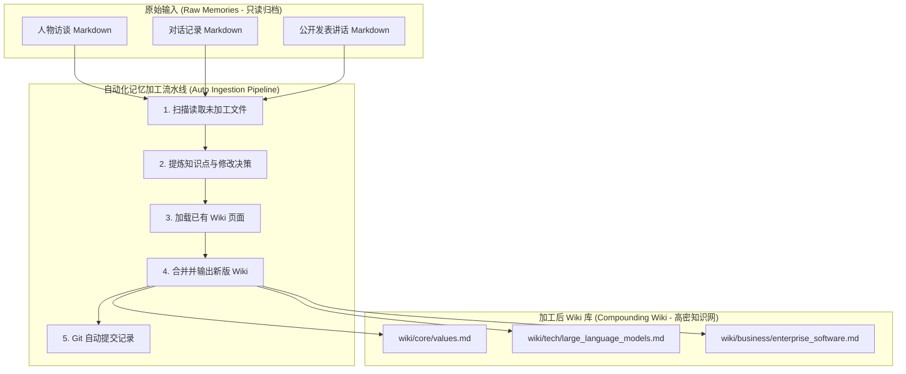

# llme 个人数字克隆系统——记忆升级与加工流水线方案

为了满足未来持续补充大量访谈、对话、演讲等多样化原始记忆的需求，并提高 RAG（检索增强生成）的准确度与上下文利用效率，本方案提出了一套**双轨并行、渐进演进**的记忆升级方案。

本方案深度参考了 Andrej Karpathy 提倡的 **"LLM-Wiki"** 模式，即不直接将低密度的原始资料丢给 RAG，而是通过 LLM 自动化提取原始输入中的“核心知识点”，并增量融入、重构为高信息密度、相互关联的 Markdown Wiki 知识网。

---

## 1. 核心设计思路：从“原始数据”到“高密Wiki”

在传统的 RAG 系统中，多模态的原始文本被切片（Chunking）后直接存入向量库进行相似度检索。这种方式在面对对话记录、访谈、演讲等口语化或低密度信息时，存在以下问题：
*   **信息密度低**：口语中有大量的语气词、重复和过渡句，浪费了大模型的 Token 预算。
*   **上下文割裂**：物理切片容易导致语义和逻辑中断。
*   **难以自我演进**：无法将新产生的信息与旧有信念自动进行合并与更新。

**LLM-Wiki 模式的解决办法：**
1.  **只读原始归档**：保留原始文件，作为可追溯、可审计的数据源。
2.  **自动化加工提炼**：通过 LLM 提取原始资料中的“核心知识点”，免去人工干预，实现高效率的大批量自动更新。
3.  **高密度与关联性**：Wiki 是高度凝练的知识网页，各页面间通过双链（如 `[[Concept]]`）相互关联。新旧观点在同一页面内自动合并与演进。
4.  **无干预的可审计性（Auditability）**：加工过程不设人工审核阻塞，而是通过“YAML 元数据回溯”加“Git 版本控制系统（VCS）历史”来实现完全透明的事后审计。

---

## 2. 记忆系统双轨架构设计

我们在现有的 `profiles/{name}/` 下引入两个平行的目录：`raw_memories/`（原始记忆轨）和 `knowledge/wiki/`（加工知识轨）。



### 2.1 原始记忆轨（`raw_memories/`）
用来永久存储原始输入，不做任何物理切割或篡改，作为最底层的审计可信数据源。

*   **目录结构**：
    ```text
    profiles/{name}/raw_memories/
    ├── interviews/          # 访谈记录
    ├── dialogues/           # 微信聊天/会议等对话记录
    └── speeches/            # 演讲、文章、讲话等单向输出
    ```
*   **文件格式**：使用 YAML Frontmatter 记录元信息，后面跟完整的原文。例如：
    ```markdown
    ---
    id: raw-2026-06-30-01
    source_type: interview
    title: "2026年夏季关于大模型商业落地的访谈"
    date: 2026-06-30
    interviewer: "张三"
    processed: true
    processed_date: 2026-06-30
    ---
    问：您怎么看当前大模型在 B 端的落地？
    答：我认为很多企业走入了误区，他们试图做大而全的系统，但实际上最迫切的需求是具体业务流的微小自动化……
    ```

### 2.2 加工知识轨（`knowledge/wiki/`）
通过加工流水线自动提炼，将原始数据转化为高密度的主题页面。

*   **目录结构**：
    ```text
    profiles/{name}/knowledge/wiki/
    ├── index.yaml           # 整个 Wiki 节点的全局索引与链接图谱
    ├── business/            # 商业认知主题
    │   ├── enterprise_software.md
    │   └── team_management.md
    └── tech/                # 技术认知主题
        ├── large_language_models.md
        └── hardware_acceleration.md
    ```
*   **文件格式**：每个 Wiki 页面是一个关于特定概念、观点或事实的高密度总结，使用 Obsidian 风格的双链进行互联，并显式追踪数据源。例如 `enterprise_software.md`：
    ```markdown
    ---
    title: 企业级软件服务的落地逻辑
    domain: business
    tags: [saas, b-end]
    last_updated: 2026-06-30
    sources: [raw-2026-06-30-01] # 显式关联的原始记忆 ID，供事后审计
    ---
    # 企业级软件服务的落地逻辑

    企业级软件的核心价值在于**具体业务流的微小自动化**，而不是宏大的架构。

    ## 核心观点
    *   **从小处切入**：企业应该规避大而全的改造，优先选择能立即提升效率的单点环节。
    *   **数据孤岛是伪命题**：在业务逻辑未理顺前，试图打通所有数据往往带来灾难性的开发成本。

    ## 关联阅读
    *   关于组织配合，参考 [[team_management]]
    *   关于大模型技术的具体应用，参考 [[large_language_models]]
    ```

---

## 3. 自动化记忆加工与画像更新审计流水线

我们通过编写一个本地处理脚本 `scripts/process-memory.ts`，借助 LLM 自动将原始记忆加工合并至现有 Wiki，并实时覆写更新数字人情境层画像。

### 3.1 加工流水线步骤

1.  **识别未加工数据**：扫描 `profiles/{name}/raw_memories/` 下所有 `processed: false` 的原始 Markdown 文件。
2.  **双向分析与提取**：
    调用 LLM 读取原始文件，同时提取出“高密度知识点”（用于更新 Wiki 记忆）以及“短期情境增量”（用于更新短期画像层）。Prompt 要求输出格式为：
    ```json
    {
      "concepts": [
        {
          "name": "概念/主题名称",
          "summary": "高密度的判断和陈述",
          "evidence": "原始文件中的对应金句或依据",
          "action": "create | update",
          "target_wiki": "关联的 wiki 文件名"
        }
      ],
      "context_updates": {
        "current_focus": ["新增或修改的工作重心要点，若无则为空数组"],
        "relationships": ["新增或修改的业务/人际关系节点变动描述，若无则为空数组"],
        "environment": ["新增或修改的宏观外部局限或机遇要点，若无则为空数组"]
      }
    }
    ```
3.  **双向合并写入**：
    *   **记忆库合并**：
        *   **新建**：如果概念在现有 Wiki 中不存在，LLM 基于预设模板在 `knowledge/wiki/` 中生成新的主题文件。
        *   **更新**：如果概念已存在，LLM 读取原页面，将新观点和原依据“合并融入”重新进行文字编排，并在 YAML 中将此原始文件 ID 追加到 `sources` 列表中。
    *   **情境层覆写**：
        *   若 `context_updates` 包含更新要点，脚本读取对应的 `profile/context/` 下的文件（如 `current_focus.md` 等），调用 LLM 结合新信息重新整合生成最新的 Markdown 文件内容并直接覆写，确保画像始终处于最新状态。
4.  **自动写入与 Git 归档**：
    脚本直接将修改后的内容写入对应的 Wiki 目录与 `profile/context/` 目录中，同时修改原始文件的 `processed` 状态为 `true`。完成后，脚本自动执行 `git commit -m "auto-process: update memory & context based on raw-2026-06-30-01"`。

### 3.2 可审计性设计
由于去除了运行中的人工确认步骤，我们通过以下两种方式确保整个更新过程具备 100% 的可追溯性与可审计性：
1.  **元数据追溯（Metadata Traceability）**：每个加工出来的 Wiki 文件都在 Frontmatter 的 `sources` 中保留了所有贡献过观点的原始记忆 ID。审计人员可以根据 ID 快速查找到对应的 `raw_memories/` 原文，查验提炼是否存在偏差。
2.  **版本历史审计（Git Audit Trail）**：每一次加工行为都会自动产生一次 Git 提交。开发和业务管理人员可以通过 `git log -p` 或 Git 可视化客户端查阅每次更新的具体 Diff 变更，必要时可以使用 `git revert` 撤销某次加工。

---

## 4. 渐进式双轨并行与平滑过渡策略

在开发和试运行阶段，**必须保证原有的记忆管理方式不被破坏**。

### 4.1 目录并行结构
*   **现有传统记忆**（保持原样）：`profiles/{name}/knowledge/entries/` 和 `profiles/{name}/knowledge/decisions/`。
*   **升级记忆**（独立目录）：`profiles/{name}/knowledge/wiki/` 与 `profiles/{name}/raw_memories/`。

### 4.2 代码检索双轨兼容

修改后端 [prompt-assembler.ts](file:///Users/zhoufan/Public/workspace/llme/app/server/src/lib/prompt-assembler.ts) 与 [knowledge-retriever.ts](file:///Users/zhoufan/Public/workspace/llme/app/server/src/lib/knowledge-retriever.ts)，引入环境变量或配置项控制检索模式。

#### 1. 配置项定义
在 `app/server/src/config.ts` 中增加：
```typescript
// 检索模式: 'legacy' (仅使用 entries & decisions) | 'wiki' (仅使用新 wiki) | 'dual' (并行混合检索)
export const MEMORY_RETRIEVAL_MODE = (process.env.MEMORY_RETRIEVAL_MODE || 'legacy') as 'legacy' | 'wiki' | 'dual';
```

#### 2. 检索逻辑并行实现
在 [knowledge-retriever.ts](file:///Users/zhoufan/Public/workspace/llme/app/server/src/lib/knowledge-retriever.ts) 中重构 `retrieveKnowledge` 方法，支持并行调用：

```typescript
import { MEMORY_RETRIEVAL_MODE } from '../config'

export async function retrieveKnowledge(
  knowledgeDir: string,
  domains: string[],
  query: string
): Promise<string[]> {
  const mode = MEMORY_RETRIEVAL_MODE;

  if (mode === 'legacy') {
    return retrieveLegacyKnowledge(knowledgeDir, domains, query);
  }

  if (mode === 'wiki') {
    return retrieveWikiKnowledge(knowledgeDir, domains, query);
  }

  // dual 模式下，并行检索，合并结果
  const [legacyResults, wikiResults] = await Promise.all([
    retrieveLegacyKnowledge(knowledgeDir, domains, query),
    retrieveWikiKnowledge(knowledgeDir, domains, query),
  ]);

  // 融合规则示例：Wiki优先（取前6条），Entries作为补充（取前4条），总数不超过10条
  return [...wikiResults.slice(0, 6), ...legacyResults.slice(0, 4)];
}

// 兼容老版本的检索逻辑
async function retrieveLegacyKnowledge(knowledgeDir: string, domains: string[], query: string): Promise<string[]> {
  // 原有 entries & decisions 检索代码...
  return []; 
}

// 编写新的 Wiki 检索逻辑
async function retrieveWikiKnowledge(knowledgeDir: string, domains: string[], query: string): Promise<string[]> {
  // 1. 读取 knowledge/wiki 目录下的所有主题 Markdown 页面
  // 2. 根据 domains 进行初步筛选
  // 3. 计算用户 Query 与各 Wiki 页面的标题、标签及正文核心词匹配度并打分
  // 4. 返回得分前 N 的高信息密度 Wiki 页面内容
  return [];
}
```

### 4.3 渐进式验证方案（Shadow Test）

在开发和试运行期间，生产环境的聊天用户依然维持 `legacy` 模式，确保业务无感知。我们在后台使用诊断接口进行验证：

1.  **生产环境对话**：设置 `MEMORY_RETRIEVAL_MODE=legacy`，使用传统的 Entries 结构，保证线上克隆对话不被破坏。
2.  **测试端验证**：
    在 `/api/diagnostics/full-chat` 路由中，通过 Query 参数传递 `mode` 触发新检索逻辑：
    `http://localhost:8000/api/diagnostics/full-chat?profileId=elonmusk&q=你对人工智能发展的看法&mode=wiki`
    该测试请求会强制使用新 Wiki 数据源组装 Prompt 并请求大模型。
3.  **指标比对**：
    针对相同的测试集问题分别执行 `legacy` 和 `wiki` 模式，评估在输出的“高密度认知点覆盖度”、“回答结构清晰度”以及“大模型 Token 占用成本”等指标上的表现。只有当 Wiki 表现完全优于现有方案后，再切换全局环境变量，弃用老结构。

---

## 5. 迁移计划里程碑与实施排期

*   **Milestone 1：基础目录创建与双轨检索代码框架（已立项）**
    *   在 profiles 下建立 `raw_memories/` 与 `knowledge/wiki/` 目录结构。
    *   修改 [knowledge-retriever.ts](file:///Users/zhoufan/Public/workspace/llme/app/server/src/lib/knowledge-retriever.ts)，实现支持双轨运行的 `retrieveKnowledge` 总控层代码。
*   **Milestone 2：自动化离线加工脚本（不设 Review 阻断）**
    *   编写 `scripts/process-memory.ts`。
    *   实现从原始文本到 Wiki 页面的提取、新建、自动合并写入流程，并集成 Git 自动 commit 记录机制。
*   **Milestone 3：管理后台可审计视图升级（Admin.tsx）**
    *   升级 React 的 [Admin.tsx](file:///Users/zhoufan/Public/workspace/llme/app/web/src/pages/Admin.tsx) 视图，提供 `raw_memories/` 审计面板，展示每个 Wiki 页面的 `sources` 溯源图表与 Git 修改历史。
*   **Milestone 4：Shadow Test 与评估修正**
    *   执行多轮 Shadow 自动化测试，验证加工逻辑对连续多份访谈输入在合并时是否发生语义漂移，并在代码层面进行鲁棒性修正。
*   **Milestone 5：全量上线与历史数据归档**
    *   将 `MEMORY_RETRIEVAL_MODE` 切换为 `wiki`，将传统的 entries 数据打包归档。
