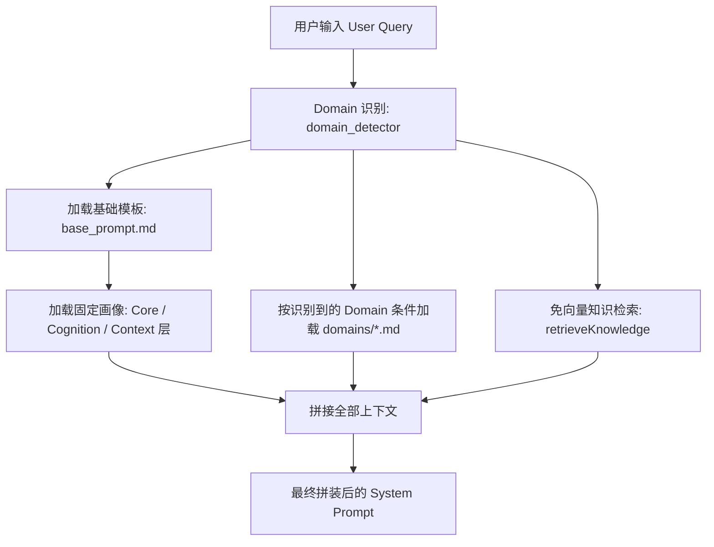

# llme — 个人数字克隆系统

llme 是一个轻量级的个人数字克隆系统。它通过结构化的个人画像提示词（Profiles）与个人知识记忆库（Knowledge Base），结合大语言模型（LLM）的推理能力，在不进行监督微调（SFT）的前提下，实现对特定个人的认知方式、思维框架以及决策逻辑的复现。

---

## 1. 产品定位与核心原则

*   **轻量化与非微调（Non-SFT）**：系统完全依托 **Prompt Engineering（提示词工程）** 与 **RAG（检索增强生成）** 技术，不需要针对大模型进行算法训练与参数调整。
*   **认知与决策复刻**：系统的核心目标是复刻克隆对象的“思考与决策逻辑”（即“怎么想、如何做出决策”），而非生硬地模仿其语气、措辞或口头禅。
*   **Git 友好型存储**：所有画像文件与知识库数据均采用标准的 **Markdown + YAML** 格式保存在本地文件系统中，无需依赖关系型或向量数据库，方便进行人工审阅、修改以及 Git 版本控制。
*   **解耦设计**：个人静态画像与动态更新的知识库分离，便于独立维护、修改与演进。
*   **人工审核流**：画像的更新由 LLM 提取增量差异后生成修改建议（Diff），经由用户人工审核确认后，合并进入画像库。

---

## 2. 系统架构与目录结构

整个项目基于 Monorepo 结构管理，目录结构如下：

```text
llme/
├── README.md                        # 本说明文档
├── PRODUCT.md                       # 产品定义与规划文档
├── TECHNICAL.md                     # 技术选型与系统设计文档
├── package.json                     # 项目根依赖及全局启动脚本
├── vercel.json                      # Vercel 部署配置
├── .env.example                     # 环境变量模板文件
├── profiles/                        # 存放人物画像和共享资源的目录
│   ├── create-profile.sh            # 新建数字人画像脚手架脚本
│   ├── _shared/                     # 共享系统模板
│   │   └── system/
│   │       └── base_prompt.md       # 共享的基础角色 System Prompt
│   ├── duanyongping/                # 数字人示例：段永平
│   │   ├── meta.yaml                # 数字人基本元信息
│   │   ├── assets/                  # 静态资源，如头像
│   │   ├── system/
│   │   │   ├── README.md            # 系统 prompt 使用说明
│   │   │   └── assembly.md          # 详细的提示词上下文组装规则
│   │   ├── profile/                 # 个人画像结构化定义
│   │   │   ├── core/                # 核心层
│   │   │   │   ├── values.md        # 核心价值观
│   │   │   │   ├── beliefs.md       # 基本信念
│   │   │   │   └── personality.md   # 性格特质
│   │   │   ├── cognition/           # 认知层
│   │   │   │   ├── mental_models.md     # 惯用思维框架
│   │   │   │   ├── decision_patterns.md  # 决策模式
│   │   │   │   └── known_biases.md      # 已知认知偏差
│   │   │   ├── domains/             # 领域层（根据业务按需扩展）
│   │   │   │   ├── tech.md          # 技术领域认知判断
│   │   │   │   └── business.md      # 商业与投资领域认知
│   │   │   └── context/             # 情境层
│   │   │       ├── current_focus.md # 当前工作重心与焦点
│   │   │       ├── relationships.md # 关键人际/业务关系网络
│   │   │       └── environment.md   # 当前宏观外部环境认知
│   │   └── knowledge/               # 个人动态知识记忆库
│   │       ├── index.yaml           # 轻量化统计索引（标签及领域计数）
│   │       ├── entries/             # 记录个人观点的 Markdown 知识条目
│   │       └── decisions/           # 记录决策推理过程的 Markdown 决策日志
│   └── elonmusk/                    # 数字人示例：埃隆·马斯克（结构与段永平一致）
└── app/                             # 应用源码目录
    ├── package.json                 # 应用层依赖配置文件
    ├── pnpm-workspace.yaml          # pnpm 工作空间配置
    ├── server/                      # Hono 后端服务
    │   ├── package.json
    │   ├── tsconfig.json
    │   └── src/
    │       ├── index.ts             # 后端入口（绑定 API 路由）
    │       ├── app.ts               # Hono App 路由总控与 CORS 配置
    │       ├── config.ts            # 环境变量加载及配置项管理
    │       ├── types.ts             # 类型定义文件
    │       ├── lib/                 # 核心逻辑模块
    │       │   ├── domain_detector.ts     # 查询领域关键词识别器
    │       │   ├── knowledge_retriever.ts # 知识库检索算法实现
    │       │   ├── profile_loader.ts      # 本地画像文件加载与解析器
    │       │   └── prompt_assembler.ts    # System Prompt 动态拼装模块
    │       └── routes/              # API 路由实现
    │           ├── chat.ts          # 对话与 LLM 交互接口
    │           ├── profiles.ts      # 获取数字人列表、文档及头像接口
    │           ├── profile-data.ts  # 获取数字人资料接口（Query 传参）
    │           └── diagnostics.ts   # 诊断接口（环境、上游连接测试）
    └── web/                         # React 前端单页应用（Vite 构建）
        ├── package.json
        ├── tsconfig.json
        ├── vite.config.ts
        ├── tailwind.config.js
        ├── index.html
        ├── scripts/
        │   └── sync-profile-assets.mjs # 同步数字人静态资源脚本
        └── src/
            ├── main.tsx             # 前端项目入口
            ├── App.tsx              # 应用布局、全局状态与认证控制
            ├── api.ts               # API 网络请求封装
            ├── types.ts             # 前端类型定义
            ├── index.css            # 基础样式与 Tailwind 引入
            ├── components/          # 共享 UI 组件
            │   ├── MessageBubble.tsx # 对话气泡（支持 Markdown 渲染）
            │   └── ProfileAvatar.tsx # 数字人头像组件
            └── pages/               # 核心页面视图
                ├── Chat.tsx         # 对话交互主界面
                ├── Admin.tsx        # 资料库管理与查看界面（只读）
                └── Login.tsx        # 登录认证页面
```

---

## 3. 数字人画像与知识库 Schema

### 3.1 画像文件元数据 (YAML Frontmatter)
所有画像 Markdown 文件顶部包含统一的 YAML 元信息：
```yaml
---
layer: core | cognition | domains | context # 画像文件所属层次
last_updated: YYYY-MM-DD                 # 上次更新日期
stability: high | medium | low           # 预期更新频率（High-年、Medium-季/月、Low-周）
---
```

### 3.2 知识条目 Schema (`knowledge/entries/`)
文件名命名格式为 `YYYY-MM-DD-{slug}.md`，包含如下元数据：
```yaml
---
id: "YYYY-MM-DD-{n}"
date: YYYY-MM-DD
type: opinion | framework | fact | reflection # 观点、框架、事实、反思
domain: [tech, business, product, people, life]
tags: [ai, investing]
confidence: high | medium | low # 信心指数
source: "来源描述"
related_profile: [] # 关联的画像章节文件路径
---
[这里是知识条目的正文内容]
```

### 3.3 决策日志 Schema (`knowledge/decisions/`)
记录具体的历史决策和背后的逻辑推理。正文包含固定的四段式结构：
```yaml
---
id: "decision-YYYY-MM-DD-{n}"
date: YYYY-MM-DD
type: decision
domain: [business]
tags: [startup]
outcome: pending | validated | invalidated # 决策状态（待定、证实、证伪）
---
## 场景
[决策发生的背景与面临的问题]

## 选项对比
[当时考虑的不同方案及其优缺点对比]

## 决策及推理
[最终做出的决定以及核心推理逻辑]

## 后续验证
[一段时间后进行的事后反思与结论验证]
```

---

## 4. 核心工作流程与核心算法

### 4.1 新建数字人画像脚手架
在 `profiles/` 目录下提供了一个自动创建数字人模板的脚本 `create-profile.sh`：
*   **执行方式**：
    ```bash
    ./profiles/create-profile.sh <profile-name>
    ```
*   **作用**：在 profiles 目录下生成以 `<profile-name>` 命名的子目录，并建立完整的画像层文件（价值观、信念、性格、思维模式、决策模式、认知盲区、技术、商业、焦点、关系、环境等）和知识库空模板，附带详细的写作指南和 YAML Frontmatter。

### 4.2 对话检索与 Prompt 组装
当用户在前端向某个数字人发起提问时，后端的 `prompt_assembler.ts` 按以下规则组装 System Prompt 作为上下文传递给大模型：



1.  **基础 Prompt 加载**：读取 `profiles/_shared/system/base_prompt.md` 并使用数字人的 `meta.yaml` 数据填充占位符。
2.  **固定画像加载**（始终全量加载）：包含 `profile/core/`、`profile/cognition/`、`profile/context/` 目录下的所有配置文件。
3.  **条件加载画像**：使用 `domain_detector.ts` 规则化识别 Query 中是否含有 `tech` 或 `business` 关键词。若识别到，则加载对应的 `domains/{domain}.md`；若未能识别出任何特定领域，则默认加载所有 Domain 画像文件。
4.  **知识和决策检索**：调用检索算法匹配最相关的最多 10 条知识条目以及 5 条近期决策日志，并使用 XML 标签包装（例如 `<knowledge>`）拼接在 Prompt 尾部。

### 4.3 免向量知识检索算法
为保持系统轻量，llme 在初期未引入向量数据库，而是采用基于关键词的匹配算法（代码见 `knowledge-retriever.ts`）：
1.  **Domain 过滤**：若查询被归类为特定 Domain，则仅在 `domain` 数组中包含该 Domain 的知识与决策条目中检索。
2.  **Tag 交集打分**：将用户的 Query 拆分为分词，过滤并计算知识条目中 `tags` 数组与 Query 分词的重合个数，作为该条目的得分（`tagScore`）。
3.  **排序与截取**：根据得分降序排列（得分相同时按日期降序），最终提取前 **10 条** 知识条目与最近的 **5 条** 决策日志。

---

## 5. 本地开发与启动指南

### 5.1 环境配置
在项目根目录下，根据 `.env.example` 创建实际运行的 `.env` 配置文件：
```bash
cp .env.example .env
```
修改其中的配置参数：
```ini
OPENAI_API_KEY=your-api-key                    # OpenAI 兼容的 API Key
OPENAI_BASE_URL=https://openrouter.ai/api/v1   # API 接口请求基地址
OPENAI_MODEL_NAME=google/gemini-3.1-flash-lite  # 调用的推理模型名称

# 可选配置
PORT=3001                                      # 后端服务端口（默认 3001）
PROFILES_DIR=./profiles                        # 数字人画像存放根路径
```

### 5.2 安装依赖
项目推荐使用 pnpm 作为包管理器，在根目录下执行：
```bash
pnpm install
```

### 5.3 启动开发服务器
通过并发启动脚本，同时运行 Hono 后端 API 服务 and Vite 前端 Dev 开发服务器：
```bash
pnpm dev
```
*   **前端访问地址**：`http://localhost:5173`（默认由 Vite 分配）
*   **后端 API 服务**：`http://localhost:3001`（前端通过 Vite 代理指向 `/api` 路径）

### 5.4 登录凭证
前端系统默认设有测试账号保护（详见 `Login.tsx`），访问控制台时请输入以下默认凭证：
*   **用户名**：`tester`
*   **密码**：`tester123`

---

## 6. API 路由设计

后端服务通过 Hono 暴露如下 API 接口，基准路径为 `/api`：

| 模块 | 请求方式 | 路由路径 | 参数 | 描述 |
| :--- | :---: | :--- | :--- | :--- |
| **数字人管理** | `GET` | `/api/profiles` | 无 | 获取所有配置了 `meta.yaml` 的数字人列表 |
| | `GET` | `:id` (参数形式 `/api/profiles/:id/documents`) | 路径参数 `:id` | 加载指定数字人的所有画像、系统及知识库文档 |
| | `GET` | `/api/profiles/:id/avatar` | 路径参数 `:id` | 获取该数字人的头像图片文件 |
| **数字人数据** | `GET` | `/api/profile/documents` | `?id={id}` | 备用获取指定数字人文稿的接口 |
| | `GET` | `/api/profile/avatar` | `?id={id}` | 备用获取指定数字人头像的接口 |
| **对话交互** | `POST` | `/api/chat` | JSON Body: `{ profileId, messages }` | 核心对话接口，接收消息历史并流式/常规返回克隆回答 |
| **诊断工具** | `GET` | `/api/diagnostics/env` | 无 | 获取 OpenAI 环境变量状态（如 Key 是否存在、地址、模型名等） |
| | `GET` | `/api/diagnostics/upstream`| 无 | 测试上游 LLM 服务连通性并返回预览内容 |
| | `GET` | `/api/diagnostics/full-chat`| `?profileId={id}&q={query}` | 模拟拼装完整的 Prompt 并执行单次极短生成测试 |
| | `POST` | `/api/diagnostics/echo` | JSON Body | 连通性 Echo 回显测试接口 |
| **健康检查** | `GET` | `/api/health` | 无 | 服务可用性健康检查接口，成功返回 `{ ok: true }` |
